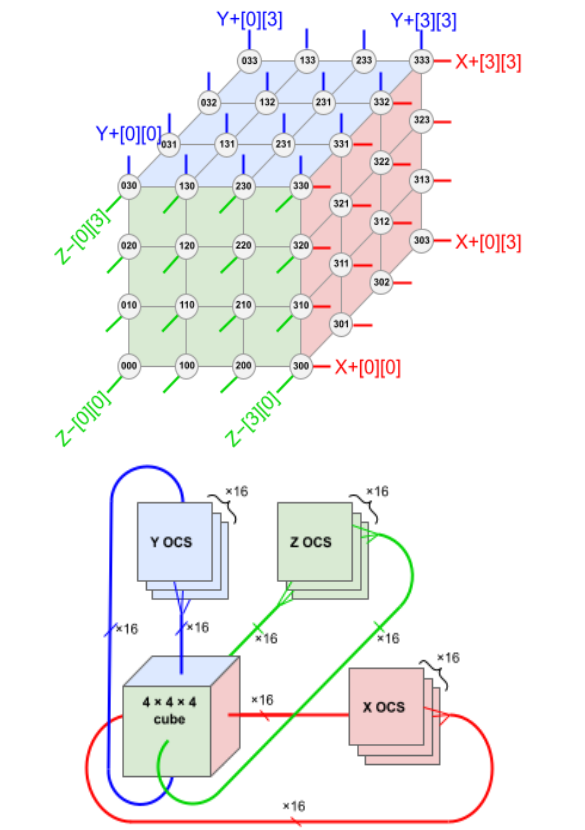
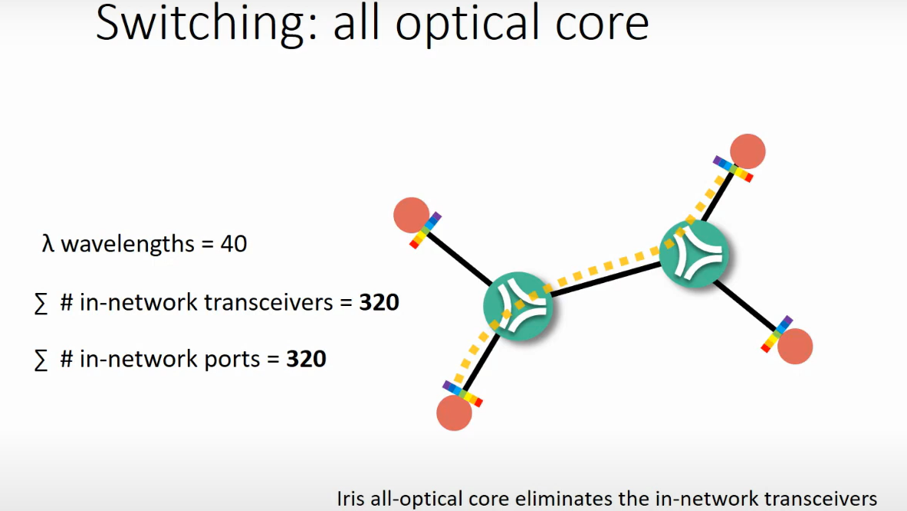

# SONiC-OCS Project Overview

## Charter

sonic-ocs-wg is working on extending SONiC to support optical circuit switches:

- Define OCS device management data models and NBIs, mainly gNMI and REST APIs
- Design and implement network operating system functionality for OCS
- Support OCS functionality on the virtual machine platform `ocs-kvm` for development and testing, similar to the SONiC `vs` platform
- Support at least one OCS device from two vendors
- Establish OCS test cases and environments to be used as OCS device verification criteria

## What is OCS

Optical circuit switch (OCS), also known as an all-optical switch, is a technology that establishes optical connections between fibers, allowing data transmission without electrical switching and conversion (OEO). Here are some advantages of OCS compared to electrical switches:

- **Improved performance:** OCS can offer lower latency and higher throughput because it operates at the physical layer, directly switching light signals rather than processing electrical packets.
- **Scalability:** OCS can be used to create large-scale, reconfigurable networks without the limitations of traditional electrical switches.
- **Reduced energy consumption:** OCS consumes less power than electrical packet switches (EPS), leading to significant energy savings in large data centers.
- **Reconfigurable topologies:** OCS enables dynamic, logical topologies that can be adapted to changing communication patterns.
- **Failure resilience:** OCS can provide alternative paths for data transmission, improving network resilience.

As such, OCS can be used in various network use cases. One of the main applications of OCS is to connect a large number of AI computing nodes to form an AI supercomputing cluster, as shown in the following diagram ([source](https://arxiv.org/pdf/2304.01433)):

  

Another OCS use case is to provide low-power, low-latency inter–data center connections (DCI), as shown in the following diagram ([source](https://www.microsoft.com/en-us/research/publication/beyond-the-mega-data-center-networking-multi-data-center-regions/)):

  

## Why SONiC for OCS

SONiC – Software for Open Networking in the Cloud – has emerged as a groundbreaking open-source network operating system (NOS) designed for white box switches, providing L2, L3, and L4 functionality. Its modular structure is based on Debian Linux and the Switch Abstraction Interface (SAI) layer, which acts as a translator between the switch ASIC and the software. That makes SONiC an open-source NOS that can work with multi-vendor hardware, reducing vendor lock-in. SONiC architecture comprises a collection of software components and tools that work in harmony to offer serviceability, extensibility, development agility, and resource efficiency. Major subsystems run in Docker containers and use inter-process communication within the centralized system. This architecture makes it feasible to extend SONiC to other types of network devices, including OCS.

Currently, OCS devices typically run vendor-specific, proprietary network operating systems (NOSs). This lack of standardization across NOS capabilities and features increases both capital expenditure (CapEx) and operational expenditure (OpEx) in large-scale DCI networks.

The **SONiC for OCS project** proposes extending SONiC to support OCS devices with the following benefits:

- For hyperscale network users and service providers, introducing OCS in the SONiC community enables consistent management of multi-layer network infrastructure from the IP layer (switches and routers) through the optical layer. This significantly simplifies network management tools and controllers.

- For optical device vendors, existing SONiC NOS infrastructure and generic features—such as user management, security, and management network modules—can be reused. This reduces time to market, improves software quality, and lowers development costs. Joining the SONiC ecosystem also allows vendors and users to collaborate through the SONiC open-source community.

## Design principles

While SONiC is a packet-switch NOS, its modular design and built-in extensibility infrastructure allow developers to add functionality beyond packet switching.

The following guidelines should be followed while developing a SONiC-based NOS for OCS:

- Fully utilize SONiC's rich extension mechanisms so OCS support becomes an organic part of SONiC, treating OCS as another type of switch.

- Reuse SONiC generic system features as-is, including NBI (REST, CLI, gNMI), telemetry, user management (including TACACS+), syslog notification, SW/FW upgrade, NTP, database management, and chassis/PSU/LED/FAN/temperature management.

- Keep OCS changes modular and relatively isolated from packet-switching logic, with no or minimal impact on existing packet-switching functions.

- For major feature gaps such as PM, alarms, and hot-pluggable support, design and implement enhancements in a generic way, not only for OCS.

- **Upstream first:** All changes should be compatible with the upstream SONiC codebase and ready to merge. The goal is for all OCS vendors to pull official SONiC code and build SONiC OCS images for their devices.

## Community
- Mailing Lists: [sonic-ocs-wp](sonic-ocs-wg+owner@lists.sonicfoundation.dev).
- Meetings: 
    - Occurs every other Wednesday from 5:00 PM to 6:00 PM effective Wed 3/11/2026 until Fri 3/9/2125
    - [Zoom Link] (https://zoom-lfx.platform.linuxfoundation.org/meeting/93135215291?password=ee96ad04-8748-44ad-988f-d104461664cc)